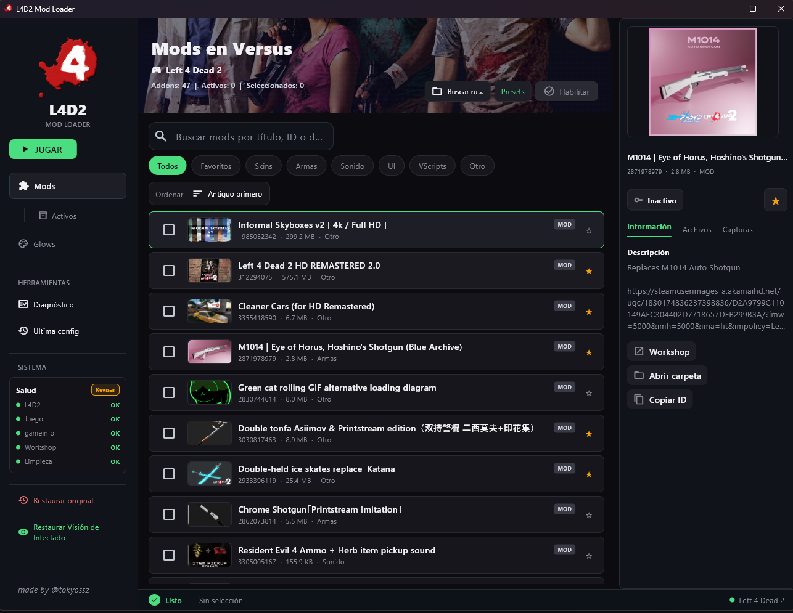
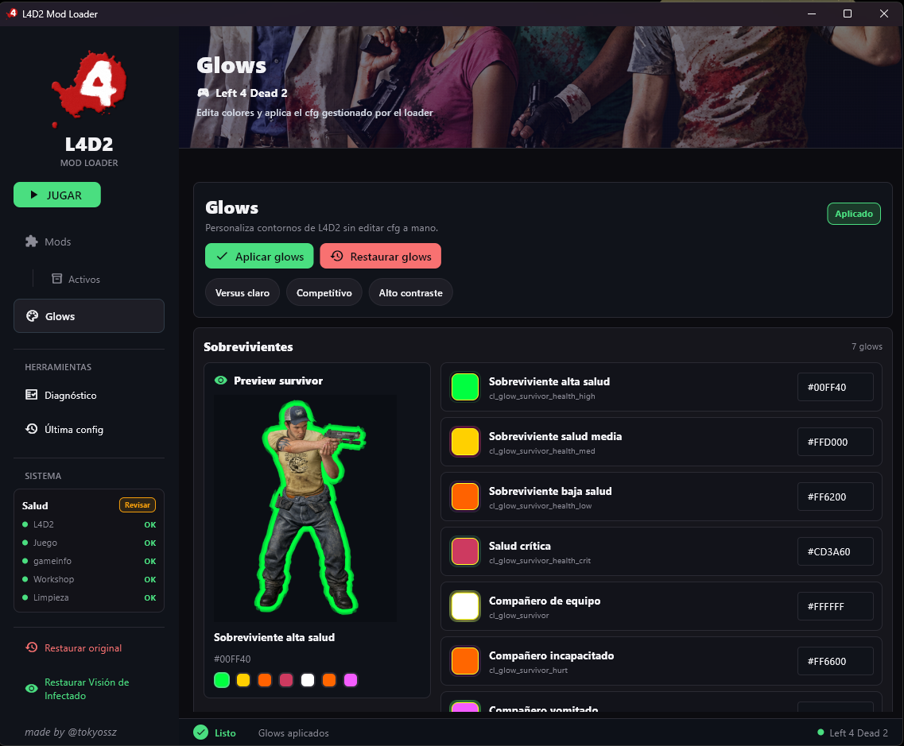
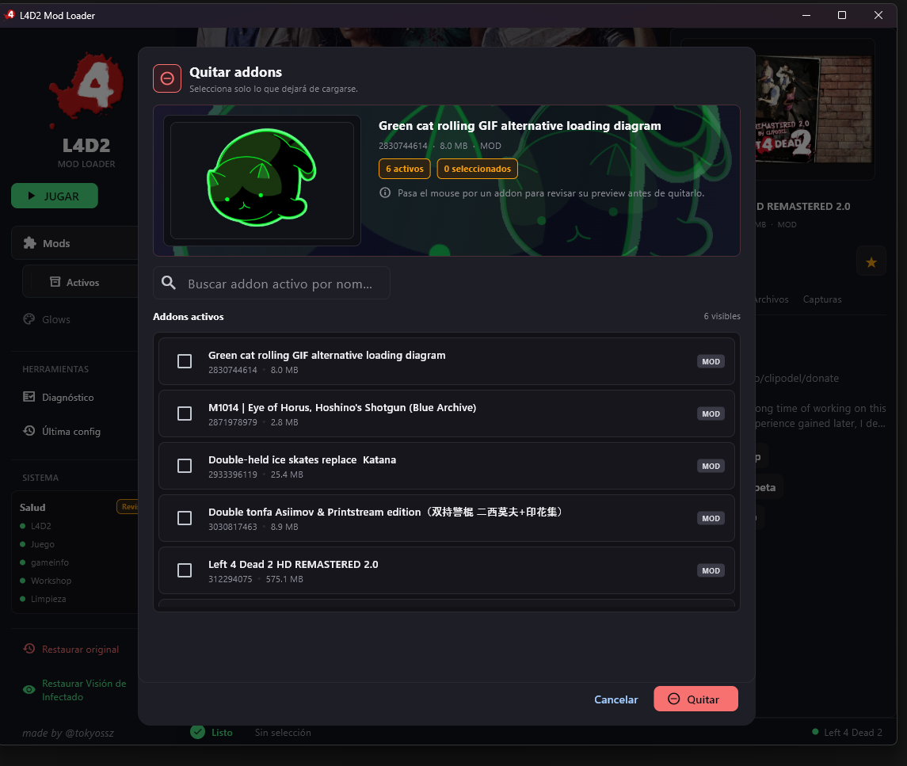
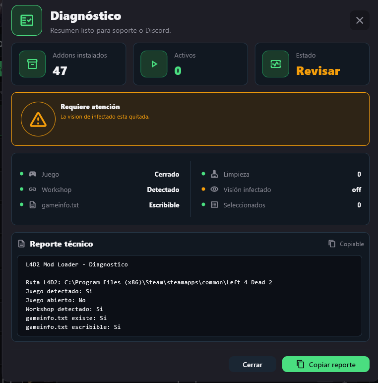

# L4D2 Mod Loader - Versus

**Version actual: 1.1.** La version aparece en la interfaz y en el reporte de diagnostico copiado para identificar cada entrega.

Herramienta para gestionar addons de **Left 4 Dead 2** sin mover archivos a mano ni editar `gameinfo.txt` manualmente.

Selecciona tus mods para Versus, activa la configuración y pulsa **JUGAR**.

## Vista previa

| Mods | Glows |
| --- | --- |
|  |  |

| Quitar addons | Diagnóstico |
| --- | --- |
|  |  |

## Características

* **Explorador de addons del Workshop**: muestra títulos, descripciones e imágenes de preview usando la API pública de Steam con caché local.
* **Activar y quitar mods**: gestiona `gameinfo.txt` mediante `SearchPaths` y crea copias administradas en `mods/<id>/pak01_dir.vpk`.
* **Activación acumulativa**: conserva los mods que ya estaban activos al agregar nuevos addons.
* **Categorías automáticas**: Skins, Armas, Sonido, UI, VScripts y Otros.
* **Favoritos y presets**: guarda combinaciones de addons para reutilizarlas rápido.
* **Dependencias sugeridas**: detecta posibles requisitos entre addons y evita ciclos.
* **Ruta manual de L4D2**: permite seleccionar la carpeta del juego o una Steam Library si Steam está en otro disco.
* **Editor de glows**: personaliza colores de sobrevivientes, infectados, objetos y Witch desde la interfaz.
* **Visión de infectado**: permite quitar o restaurar el tinte naranja/azul.
* **Restauración segura**: revierte los cambios hechos por el loader y conserva archivos o ediciones externas.
* **Watcher automático**: detecta cambios en los VPKs del Workshop sin reiniciar la app.
* **Bloqueo con juego abierto**: evita modificar archivos mientras Left 4 Dead 2 está ejecutándose.

## Requisitos

Para usar el `.exe`:

* Windows.
* Left 4 Dead 2 instalado mediante Steam.

Para correr el código fuente:

* Windows.
* Python 3.10 o superior.
* Dependencias de `requirements.txt`.

> Linux no está soportado oficialmente en esta versión.

## Uso

Si tienes el ejecutable, abre `L4D2 Mod Loader.exe`.

Si Left 4 Dead 2 está instalado dentro de `Program Files`, puede ser necesario ejecutar la app como administrador para permitir cambios en `gameinfo.txt`.

Si la app no detecta tu instalación, usa **Buscar ruta** y selecciona una de estas opciones:

* `...\steamapps\common\Left 4 Dead 2`
* `...\steamapps\common\Left 4 Dead 2\left4dead2`
* una carpeta `SteamLibrary`
* la carpeta `addons` o `workshop` del juego

## Ejecutar desde código fuente

```bash
git clone https://github.com/SOYmenchowey/l4d2-loader-mod-versus.git
cd l4d2-loader-mod-versus
pip install -r requirements.txt
python main.py
```

## Compilar el `.exe`

```bash
pip install -r requirements.txt
pyinstaller --clean --noconfirm "L4D2_Mod_Loader.spec"
```

El ejecutable generado aparecerá en `dist/`.

La compilación incluye el cliente de escritorio de Flet. Puede descargarlo la primera vez al compilar; el `.exe` distribuido no necesita descargar ese cliente al abrirse. Los metadatos e imágenes de Steam sí pueden requerir Internet.

El repositorio no incluye el `.exe` generado. `dist/`, `build/`, `.flet/`, logs, cachés y archivos `.zip` locales están ignorados por Git.

## Glows

El editor de glows crea:

```text
left4dead2/cfg/l4d2_mod_loader_glows.cfg
```

Y agrega un bloque gestionado en:

```text
left4dead2/cfg/autoexec.cfg
```

Si `autoexec.cfg` no existe, el loader lo crea. Al restaurar glows, solo se elimina el bloque y el cfg creados por el loader.

## Restauración

**Restaurar original** devuelve `gameinfo.txt`, glows, visión de infectado y copias de mods al estado anterior al loader.

Si otra herramienta o el usuario modificó `gameinfo.txt` después, el loader conserva esos cambios externos y solo retira sus propias entradas administradas.

## Notas

* El programa crea backups automáticos antes de modificar `gameinfo.txt`.
* Los addons de tipo VSCRIPT pueden no funcionar correctamente mediante este método de activación.
* La información del Workshop puede requerir conexión a Internet si no está en caché.
* Cierra Left 4 Dead 2 antes de activar, quitar o restaurar mods.

## Créditos

Hecho por **Tokyossz**.
